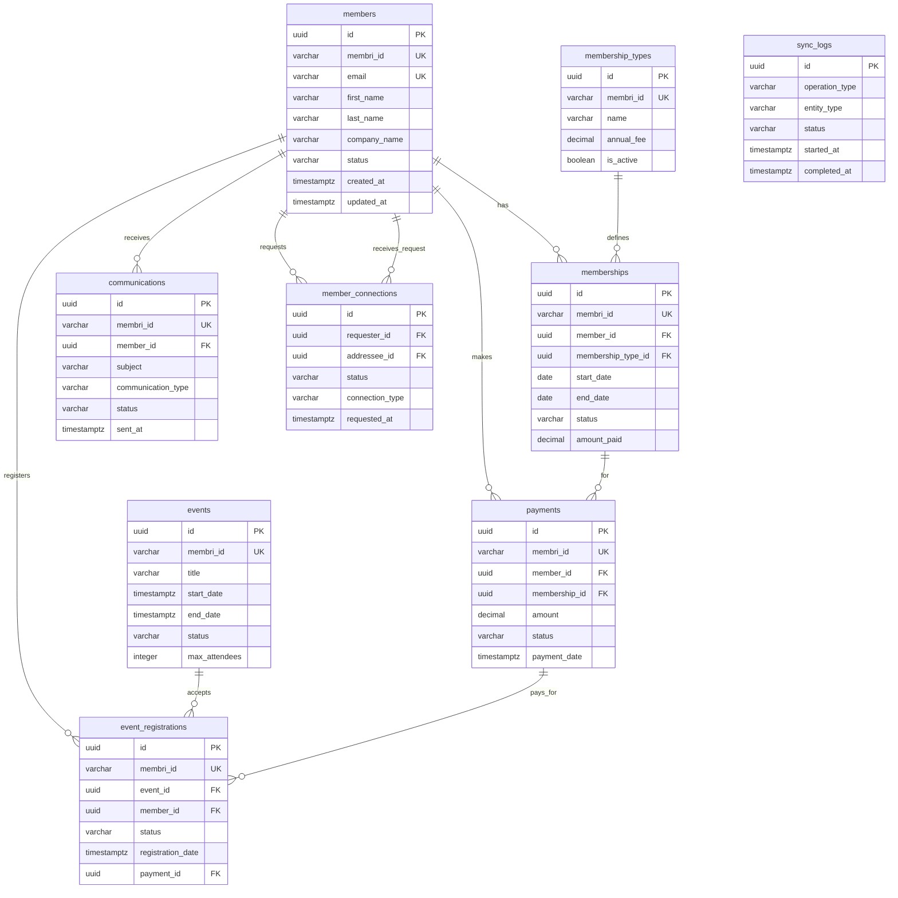

# Structure de Base de Données PostgreSQL - Armateurs du Saint-Laurent
## Système d'Adhésion avec Intégration API Membri 365

### Table des Matières
1. [Introduction](#introduction)
2. [Architecture et Synchronisation](#architecture-et-synchronisation)
3. [Structure des Tables](#structure-des-tables)
4. [Diagramme ERD](#diagramme-erd)
5. [Exemples de Requêtes SQL](#exemples-de-requêtes-sql)
6. [Guide d'Intégration Front-end](#guide-dintégration-front-end)
7. [Maintenance et Monitoring](#maintenance-et-monitoring)

---

## Introduction

Cette base de données PostgreSQL hébergée sur Supabase sert de système central pour la gestion des adhésions des Armateurs du Saint-Laurent. Elle est conçue pour :

- **Synchroniser automatiquement** avec l'API Membri 365
- **Stocker localement** toutes les données pour des performances optimales
- **Maintenir l'intégrité** des données avec un système de journalisation complet
- **Supporter** les fonctionnalités du portail membre et du site web public

---

## Architecture et Synchronisation

### Stratégie de Synchronisation
- **Import Initial** : Récupération complète des données via l'API Membri
- **Mises à Jour Incrémentales** : Via webhooks ou tâches CRON périodiques
- **Journalisation** : Traçabilité complète de toutes les synchronisations
- **Gestion des Conflits** : Priorité aux données Membri avec logs des modifications

### Flux de Données
```
API Membri 365 → Supabase Functions → PostgreSQL → Application Web
```

---

## Structure des Tables

### 1. Table `sync_logs`
Table de journalisation pour toutes les opérations de synchronisation.

```sql
CREATE TABLE sync_logs (
    id UUID PRIMARY KEY DEFAULT gen_random_uuid(),
    operation_type VARCHAR(50) NOT NULL, -- 'full_sync', 'incremental', 'webhook'
    entity_type VARCHAR(50) NOT NULL,    -- 'members', 'memberships', 'payments', etc.
    status VARCHAR(20) NOT NULL,         -- 'pending', 'success', 'error', 'partial'
    started_at TIMESTAMPTZ NOT NULL DEFAULT NOW(),
    completed_at TIMESTAMPTZ,
    records_processed INTEGER DEFAULT 0,
    records_succeeded INTEGER DEFAULT 0,
    records_failed INTEGER DEFAULT 0,
    error_details JSONB,
    membri_last_modified TIMESTAMPTZ,
    created_at TIMESTAMPTZ NOT NULL DEFAULT NOW()
);

CREATE INDEX idx_sync_logs_operation_type ON sync_logs(operation_type);
CREATE INDEX idx_sync_logs_entity_type ON sync_logs(entity_type);
CREATE INDEX idx_sync_logs_status ON sync_logs(status);
CREATE INDEX idx_sync_logs_started_at ON sync_logs(started_at);
```

### 2. Table `members`
Stockage des informations des membres avec synchronisation Membri.

```sql
CREATE TABLE members (
    id UUID PRIMARY KEY DEFAULT gen_random_uuid(),
    membri_id VARCHAR(100) UNIQUE,       -- ID externe Membri 365
    email VARCHAR(255) UNIQUE NOT NULL,
    first_name VARCHAR(100) NOT NULL,
    last_name VARCHAR(100) NOT NULL,
    company_name VARCHAR(255),
    job_title VARCHAR(255),
    phone VARCHAR(50),
    mobile_phone VARCHAR(50),
    
    -- Adresse
    address_line1 VARCHAR(255),
    address_line2 VARCHAR(255),
    city VARCHAR(100),
    province VARCHAR(50),
    postal_code VARCHAR(20),
    country VARCHAR(100) DEFAULT 'Canada',
    
    -- Statut et dates
    status VARCHAR(50) NOT NULL DEFAULT 'pending', -- 'active', 'inactive', 'pending', 'suspended'
    member_since DATE,
    date_of_birth DATE,
    
    -- Préférences
    language VARCHAR(10) DEFAULT 'fr',   -- 'fr', 'en'
    newsletter_subscription BOOLEAN DEFAULT TRUE,
    communication_preferences JSONB DEFAULT '{}',
    
    -- Synchronisation
    membri_last_modified TIMESTAMPTZ,
    last_synced_at TIMESTAMPTZ,
    sync_status VARCHAR(20) DEFAULT 'pending', -- 'synced', 'pending', 'error'
    sync_error_details JSONB,
    
    -- Métadonnées
    created_at TIMESTAMPTZ NOT NULL DEFAULT NOW(),
    updated_at TIMESTAMPTZ NOT NULL DEFAULT NOW(),
    
    -- Contraintes
    CONSTRAINT chk_status CHECK (status IN ('active', 'inactive', 'pending', 'suspended')),
    CONSTRAINT chk_language CHECK (language IN ('fr', 'en')),
    CONSTRAINT chk_sync_status CHECK (sync_status IN ('synced', 'pending', 'error'))
);

CREATE INDEX idx_members_membri_id ON members(membri_id);
CREATE INDEX idx_members_email ON members(email);
CREATE INDEX idx_members_status ON members(status);
CREATE INDEX idx_members_company_name ON members(company_name);
CREATE INDEX idx_members_last_synced_at ON members(last_synced_at);
CREATE INDEX idx_members_full_name ON members(first_name, last_name);
```

### 3. Table `membership_types`
Définition des types d'adhésion disponibles.

```sql
CREATE TABLE membership_types (
    id UUID PRIMARY KEY DEFAULT gen_random_uuid(),
    membri_id VARCHAR(100) UNIQUE,
    name VARCHAR(255) NOT NULL,
    description TEXT,
    annual_fee DECIMAL(10,2) NOT NULL,
    benefits JSONB DEFAULT '[]',
    is_active BOOLEAN DEFAULT TRUE,
    display_order INTEGER DEFAULT 0,
    
    -- Synchronisation
    membri_last_modified TIMESTAMPTZ,
    last_synced_at TIMESTAMPTZ,
    
    created_at TIMESTAMPTZ NOT NULL DEFAULT NOW(),
    updated_at TIMESTAMPTZ NOT NULL DEFAULT NOW()
);

CREATE INDEX idx_membership_types_membri_id ON membership_types(membri_id);
CREATE INDEX idx_membership_types_is_active ON membership_types(is_active);
```

### 4. Table `memberships`
Historique des adhésions de chaque membre.

```sql
CREATE TABLE memberships (
    id UUID PRIMARY KEY DEFAULT gen_random_uuid(),
    membri_id VARCHAR(100) UNIQUE,
    member_id UUID NOT NULL REFERENCES members(id) ON DELETE CASCADE,
    membership_type_id UUID NOT NULL REFERENCES membership_types(id),
    
    -- Période d'adhésion
    start_date DATE NOT NULL,
    end_date DATE NOT NULL,
    renewal_date DATE,
    
    -- Statut et tarification
    status VARCHAR(50) NOT NULL DEFAULT 'active', -- 'active', 'expired', 'cancelled', 'pending'
    amount_paid DECIMAL(10,2),
    discount_applied DECIMAL(10,2) DEFAULT 0,
    
    -- Métadonnées
    notes TEXT,
    auto_renewal BOOLEAN DEFAULT TRUE,
    
    -- Synchronisation
    membri_last_modified TIMESTAMPTZ,
    last_synced_at TIMESTAMPTZ,
    
    created_at TIMESTAMPTZ NOT NULL DEFAULT NOW(),
    updated_at TIMESTAMPTZ NOT NULL DEFAULT NOW(),
    
    CONSTRAINT chk_membership_status CHECK (status IN ('active', 'expired', 'cancelled', 'pending')),
    CONSTRAINT chk_dates CHECK (end_date > start_date)
);

CREATE INDEX idx_memberships_membri_id ON memberships(membri_id);
CREATE INDEX idx_memberships_member_id ON memberships(member_id);
CREATE INDEX idx_memberships_status ON memberships(status);
CREATE INDEX idx_memberships_dates ON memberships(start_date, end_date);
CREATE INDEX idx_memberships_renewal_date ON memberships(renewal_date);
```

### 5. Table `payments`
Historique des paiements et transactions.

```sql
CREATE TABLE payments (
    id UUID PRIMARY KEY DEFAULT gen_random_uuid(),
    membri_id VARCHAR(100) UNIQUE,
    member_id UUID NOT NULL REFERENCES members(id) ON DELETE CASCADE,
    membership_id UUID REFERENCES memberships(id),
    
    -- Détails du paiement
    amount DECIMAL(10,2) NOT NULL,
    currency VARCHAR(3) DEFAULT 'CAD',
    payment_method VARCHAR(50), -- 'credit_card', 'bank_transfer', 'cash', 'cheque'
    payment_processor VARCHAR(50), -- 'stripe', 'paypal', 'manual'
    transaction_id VARCHAR(255),
    
    -- Statut et dates
    status VARCHAR(50) NOT NULL DEFAULT 'pending', -- 'pending', 'completed', 'failed', 'refunded'
    payment_date TIMESTAMPTZ,
    due_date DATE,
    
    -- Métadonnées
    description TEXT,
    invoice_number VARCHAR(100),
    receipt_url TEXT,
    notes TEXT,
    
    -- Synchronisation
    membri_last_modified TIMESTAMPTZ,
    last_synced_at TIMESTAMPTZ,
    
    created_at TIMESTAMPTZ NOT NULL DEFAULT NOW(),
    updated_at TIMESTAMPTZ NOT NULL DEFAULT NOW(),
    
    CONSTRAINT chk_payment_status CHECK (status IN ('pending', 'completed', 'failed', 'refunded')),
    CONSTRAINT chk_payment_amount CHECK (amount > 0)
);

CREATE INDEX idx_payments_membri_id ON payments(membri_id);
CREATE INDEX idx_payments_member_id ON payments(member_id);
CREATE INDEX idx_payments_membership_id ON payments(membership_id);
CREATE INDEX idx_payments_status ON payments(status);
CREATE INDEX idx_payments_payment_date ON payments(payment_date);
CREATE INDEX idx_payments_transaction_id ON payments(transaction_id);
```

### 6. Table `events`
Gestion des événements et activités.

```sql
CREATE TABLE events (
    id UUID PRIMARY KEY DEFAULT gen_random_uuid(),
    membri_id VARCHAR(100) UNIQUE,
    
    -- Informations de base
    title VARCHAR(255) NOT NULL,
    description TEXT,
    event_type VARCHAR(100), -- 'conference', 'networking', 'training', 'social'
    
    -- Dates et localisation
    start_date TIMESTAMPTZ NOT NULL,
    end_date TIMESTAMPTZ NOT NULL,
    timezone VARCHAR(50) DEFAULT 'America/Toronto',
    location_name VARCHAR(255),
    location_address TEXT,
    location_coordinates JSONB, -- {lat: number, lng: number}
    is_virtual BOOLEAN DEFAULT FALSE,
    virtual_meeting_url TEXT,
    
    -- Paramètres d'inscription
    max_attendees INTEGER,
    registration_deadline TIMESTAMPTZ,
    registration_fee DECIMAL(10,2) DEFAULT 0,
    requires_approval BOOLEAN DEFAULT FALSE,
    is_members_only BOOLEAN DEFAULT TRUE,
    
    -- Statut
    status VARCHAR(50) NOT NULL DEFAULT 'draft', -- 'draft', 'published', 'cancelled', 'completed'
    is_featured BOOLEAN DEFAULT FALSE,
    
    -- Métadonnées
    image_url TEXT,
    attachments JSONB DEFAULT '[]',
    tags JSONB DEFAULT '[]',
    
    -- Synchronisation
    membri_last_modified TIMESTAMPTZ,
    last_synced_at TIMESTAMPTZ,
    
    created_at TIMESTAMPTZ NOT NULL DEFAULT NOW(),
    updated_at TIMESTAMPTZ NOT NULL DEFAULT NOW(),
    
    CONSTRAINT chk_event_status CHECK (status IN ('draft', 'published', 'cancelled', 'completed')),
    CONSTRAINT chk_event_dates CHECK (end_date > start_date)
);

CREATE INDEX idx_events_membri_id ON events(membri_id);
CREATE INDEX idx_events_status ON events(status);
CREATE INDEX idx_events_start_date ON events(start_date);
CREATE INDEX idx_events_event_type ON events(event_type);
CREATE INDEX idx_events_is_featured ON events(is_featured);
CREATE INDEX idx_events_registration_deadline ON events(registration_deadline);
```

### 7. Table `event_registrations`
Inscriptions des membres aux événements.

```sql
CREATE TABLE event_registrations (
    id UUID PRIMARY KEY DEFAULT gen_random_uuid(),
    membri_id VARCHAR(100) UNIQUE,
    event_id UUID NOT NULL REFERENCES events(id) ON DELETE CASCADE,
    member_id UUID NOT NULL REFERENCES members(id) ON DELETE CASCADE,
    
    -- Statut d'inscription
    status VARCHAR(50) NOT NULL DEFAULT 'pending', -- 'pending', 'confirmed', 'cancelled', 'attended', 'no_show'
    registration_date TIMESTAMPTZ NOT NULL DEFAULT NOW(),
    confirmation_date TIMESTAMPTZ,
    cancellation_date TIMESTAMPTZ,
    
    -- Informations supplémentaires
    special_requirements TEXT,
    dietary_restrictions TEXT,
    emergency_contact_name VARCHAR(255),
    emergency_contact_phone VARCHAR(50),
    
    -- Paiement si applicable
    payment_id UUID REFERENCES payments(id),
    amount_paid DECIMAL(10,2) DEFAULT 0,
    
    -- Métadonnées
    notes TEXT,
    registration_source VARCHAR(50) DEFAULT 'website', -- 'website', 'admin', 'import'
    
    -- Synchronisation
    membri_last_modified TIMESTAMPTZ,
    last_synced_at TIMESTAMPTZ,
    
    created_at TIMESTAMPTZ NOT NULL DEFAULT NOW(),
    updated_at TIMESTAMPTZ NOT NULL DEFAULT NOW(),
    
    CONSTRAINT chk_registration_status CHECK (status IN ('pending', 'confirmed', 'cancelled', 'attended', 'no_show')),
    CONSTRAINT uq_event_member_registration UNIQUE(event_id, member_id)
);

CREATE INDEX idx_event_registrations_membri_id ON event_registrations(membri_id);
CREATE INDEX idx_event_registrations_event_id ON event_registrations(event_id);
CREATE INDEX idx_event_registrations_member_id ON event_registrations(member_id);
CREATE INDEX idx_event_registrations_status ON event_registrations(status);
CREATE INDEX idx_event_registrations_registration_date ON event_registrations(registration_date);
```

### 8. Table `communications`
Historique des communications avec les membres.

```sql
CREATE TABLE communications (
    id UUID PRIMARY KEY DEFAULT gen_random_uuid(),
    membri_id VARCHAR(100) UNIQUE,
    
    -- Destinataires
    member_id UUID REFERENCES members(id) ON DELETE SET NULL, -- NULL pour communications de groupe
    recipient_emails TEXT[], -- Liste d'emails pour communications de groupe
    
    -- Contenu
    subject VARCHAR(500) NOT NULL,
    content TEXT NOT NULL,
    content_type VARCHAR(50) DEFAULT 'html', -- 'html', 'text', 'markdown'
    
    -- Type et canal
    communication_type VARCHAR(100) NOT NULL, -- 'newsletter', 'event_reminder', 'membership_renewal', 'general'
    channel VARCHAR(50) NOT NULL DEFAULT 'email', -- 'email', 'sms', 'notification'
    
    -- Statut et suivi
    status VARCHAR(50) NOT NULL DEFAULT 'draft', -- 'draft', 'scheduled', 'sent', 'failed'
    scheduled_at TIMESTAMPTZ,
    sent_at TIMESTAMPTZ,
    
    -- Métadonnées
    template_id VARCHAR(100),
    attachments JSONB DEFAULT '[]',
    tags JSONB DEFAULT '[]',
    
    -- Métriques (pour emails)
    sent_count INTEGER DEFAULT 0,
    delivered_count INTEGER DEFAULT 0,
    opened_count INTEGER DEFAULT 0,
    clicked_count INTEGER DEFAULT 0,
    bounce_count INTEGER DEFAULT 0,
    
    -- Synchronisation
    membri_last_modified TIMESTAMPTZ,
    last_synced_at TIMESTAMPTZ,
    
    created_at TIMESTAMPTZ NOT NULL DEFAULT NOW(),
    updated_at TIMESTAMPTZ NOT NULL DEFAULT NOW(),
    
    CONSTRAINT chk_communication_status CHECK (status IN ('draft', 'scheduled', 'sent', 'failed')),
    CONSTRAINT chk_communication_channel CHECK (channel IN ('email', 'sms', 'notification'))
);

CREATE INDEX idx_communications_membri_id ON communications(membri_id);
CREATE INDEX idx_communications_member_id ON communications(member_id);
CREATE INDEX idx_communications_type ON communications(communication_type);
CREATE INDEX idx_communications_status ON communications(status);
CREATE INDEX idx_communications_sent_at ON communications(sent_at);
CREATE INDEX idx_communications_scheduled_at ON communications(scheduled_at);
```

### 9. Table `member_connections`
Gestion du réseau et connexions entre membres.

```sql
CREATE TABLE member_connections (
    id UUID PRIMARY KEY DEFAULT gen_random_uuid(),
    requester_id UUID NOT NULL REFERENCES members(id) ON DELETE CASCADE,
    addressee_id UUID NOT NULL REFERENCES members(id) ON DELETE CASCADE,
    
    status VARCHAR(50) NOT NULL DEFAULT 'pending', -- 'pending', 'accepted', 'declined', 'blocked'
    connection_type VARCHAR(50) DEFAULT 'professional', -- 'professional', 'personal', 'business'
    
    message TEXT, -- Message d'accompagnement de la demande
    
    requested_at TIMESTAMPTZ NOT NULL DEFAULT NOW(),
    responded_at TIMESTAMPTZ,
    
    created_at TIMESTAMPTZ NOT NULL DEFAULT NOW(),
    updated_at TIMESTAMPTZ NOT NULL DEFAULT NOW(),
    
    CONSTRAINT chk_connection_status CHECK (status IN ('pending', 'accepted', 'declined', 'blocked')),
    CONSTRAINT chk_no_self_connection CHECK (requester_id != addressee_id),
    CONSTRAINT uq_member_connection UNIQUE(requester_id, addressee_id)
);

CREATE INDEX idx_member_connections_requester ON member_connections(requester_id);
CREATE INDEX idx_member_connections_addressee ON member_connections(addressee_id);
CREATE INDEX idx_member_connections_status ON member_connections(status);
```

### 10. Tables de Support

#### Triggers pour `updated_at`
```sql
CREATE OR REPLACE FUNCTION update_updated_at_column()
RETURNS TRIGGER AS $$
BEGIN
    NEW.updated_at = NOW();
    RETURN NEW;
END;
$$ language 'plpgsql';

-- Application aux tables principales
CREATE TRIGGER update_members_updated_at BEFORE UPDATE ON members
    FOR EACH ROW EXECUTE FUNCTION update_updated_at_column();

CREATE TRIGGER update_memberships_updated_at BEFORE UPDATE ON memberships
    FOR EACH ROW EXECUTE FUNCTION update_updated_at_column();

CREATE TRIGGER update_payments_updated_at BEFORE UPDATE ON payments
    FOR EACH ROW EXECUTE FUNCTION update_updated_at_column();

CREATE TRIGGER update_events_updated_at BEFORE UPDATE ON events
    FOR EACH ROW EXECUTE FUNCTION update_updated_at_column();

CREATE TRIGGER update_event_registrations_updated_at BEFORE UPDATE ON event_registrations
    FOR EACH ROW EXECUTE FUNCTION update_updated_at_column();

CREATE TRIGGER update_communications_updated_at BEFORE UPDATE ON communications
    FOR EACH ROW EXECUTE FUNCTION update_updated_at_column();

CREATE TRIGGER update_member_connections_updated_at BEFORE UPDATE ON member_connections
    FOR EACH ROW EXECUTE FUNCTION update_updated_at_column();
```

---

## Diagramme ERD



---

## Exemples de Requêtes SQL

### Création des Tables
```sql
-- Script de création complet disponible dans les sections précédentes
-- Exécuter dans l'ordre : sync_logs, membership_types, members, memberships, payments, events, event_registrations, communications, member_connections
```

### Synchronisation depuis l'API Membri

#### 1. Insertion/Mise à jour des Membres
```sql
-- Fonction pour synchroniser un membre
CREATE OR REPLACE FUNCTION sync_member_from_membri(
    p_membri_id VARCHAR,
    p_email VARCHAR,
    p_first_name VARCHAR,
    p_last_name VARCHAR,
    p_company_name VARCHAR DEFAULT NULL,
    p_status VARCHAR DEFAULT 'active',
    p_membri_last_modified TIMESTAMPTZ DEFAULT NOW()
)
RETURNS UUID AS $$
DECLARE
    v_member_id UUID;
BEGIN
    INSERT INTO members (
        membri_id, email, first_name, last_name, company_name, 
        status, membri_last_modified, last_synced_at, sync_status
    )
    VALUES (
        p_membri_id, p_email, p_first_name, p_last_name, p_company_name,
        p_status, p_membri_last_modified, NOW(), 'synced'
    )
    ON CONFLICT (membri_id) DO UPDATE SET
        email = EXCLUDED.email,
        first_name = EXCLUDED.first_name,
        last_name = EXCLUDED.last_name,
        company_name = EXCLUDED.company_name,
        status = EXCLUDED.status,
        membri_last_modified = EXCLUDED.membri_last_modified,
        last_synced_at = NOW(),
        sync_status = 'synced',
        updated_at = NOW()
    RETURNING id INTO v_member_id;
    
    RETURN v_member_id;
END;
$$ LANGUAGE plpgsql;
```

#### 2. Synchronisation des Événements
```sql
-- Mise à jour des événements depuis Membri
INSERT INTO events (
    membri_id, title, description, start_date, end_date,
    location_name, max_attendees, registration_fee, status,
    membri_last_modified, last_synced_at
)
SELECT 
    api_data->>'id',
    api_data->>'title',
    api_data->>'description',
    (api_data->>'start_date')::timestamptz,
    (api_data->>'end_date')::timestamptz,
    api_data->>'location',
    (api_data->>'max_attendees')::integer,
    (api_data->>'fee')::decimal,
    'published',
    NOW(),
    NOW()
FROM (
    -- Cette partie serait alimentée par l'API Membri
    VALUES ('{"id": "membri_123", "title": "Conférence Maritime 2024", "description": "...", "start_date": "2024-09-15T09:00:00Z", "end_date": "2024-09-15T17:00:00Z", "location": "Québec", "max_attendees": 100, "fee": 75.00}'::jsonb)
) AS t(api_data)
ON CONFLICT (membri_id) DO UPDATE SET
    title = EXCLUDED.title,
    description = EXCLUDED.description,
    start_date = EXCLUDED.start_date,
    end_date = EXCLUDED.end_date,
    location_name = EXCLUDED.location_name,
    max_attendees = EXCLUDED.max_attendees,
    registration_fee = EXCLUDED.registration_fee,
    membri_last_modified = EXCLUDED.membri_last_modified,
    last_synced_at = NOW(),
    updated_at = NOW();
```

### Requêtes pour l'Application Web

#### 1. Membres Actifs avec Adhésions en Cours
```sql
SELECT 
    m.id,
    m.first_name,
    m.last_name,
    m.company_name,
    m.email,
    m.phone,
    m.city,
    m.province,
    mt.name as membership_type,
    ms.start_date,
    ms.end_date,
    ms.status as membership_status
FROM members m
JOIN memberships ms ON m.id = ms.member_id
JOIN membership_types mt ON ms.membership_type_id = mt.id
WHERE m.status = 'active'
    AND ms.status = 'active'
    AND ms.end_date >= CURRENT_DATE
ORDER BY m.last_name, m.first_name;
```

#### 2. Événements à Venir avec Inscriptions
```sql
SELECT 
    e.id,
    e.title,
    e.description,
    e.start_date,
    e.end_date,
    e.location_name,
    e.max_attendees,
    e.registration_fee,
    COUNT(er.id) as current_registrations,
    COUNT(CASE WHEN er.status = 'confirmed' THEN 1 END) as confirmed_registrations
FROM events e
LEFT JOIN event_registrations er ON e.id = er.event_id
WHERE e.status = 'published'
    AND e.start_date > NOW()
    AND (e.registration_deadline IS NULL OR e.registration_deadline > NOW())
GROUP BY e.id, e.title, e.description, e.start_date, e.end_date, 
         e.location_name, e.max_attendees, e.registration_fee
ORDER BY e.start_date;
```

#### 3. Tableau de Bord Membre
```sql
-- Vue personnalisée pour le dashboard d'un membre
CREATE OR REPLACE VIEW member_dashboard AS
SELECT 
    m.id as member_id,
    m.first_name,
    m.last_name,
    m.company_name,
    
    -- Adhésion actuelle
    ms.status as membership_status,
    ms.end_date as membership_expires,
    mt.name as membership_type,
    
    -- Statistiques événements
    (SELECT COUNT(*) FROM event_registrations er 
     JOIN events e ON er.event_id = e.id 
     WHERE er.member_id = m.id AND e.start_date >= CURRENT_DATE) as upcoming_events,
    
    (SELECT COUNT(*) FROM event_registrations er 
     JOIN events e ON er.event_id = e.id 
     WHERE er.member_id = m.id AND e.start_date < CURRENT_DATE) as past_events,
    
    -- Connexions réseau
    (SELECT COUNT(*) FROM member_connections mc 
     WHERE (mc.requester_id = m.id OR mc.addressee_id = m.id) 
     AND mc.status = 'accepted') as network_connections,
    
    -- Dernière activité
    (SELECT MAX(activity_date) FROM (
        SELECT MAX(updated_at) as activity_date FROM event_registrations WHERE member_id = m.id
        UNION ALL
        SELECT MAX(updated_at) as activity_date FROM member_connections 
        WHERE requester_id = m.id OR addressee_id = m.id
    ) activities) as last_activity

FROM members m
LEFT JOIN memberships ms ON m.id = ms.member_id AND ms.status = 'active'
LEFT JOIN membership_types mt ON ms.membership_type_id = mt.id
WHERE m.status = 'active';
```

#### 4. Recherche Avancée de Membres
```sql
-- Fonction de recherche avec filtres multiples
CREATE OR REPLACE FUNCTION search_members(
    p_search_term TEXT DEFAULT NULL,
    p_city VARCHAR DEFAULT NULL,
    p_province VARCHAR DEFAULT NULL,
    p_membership_type_id UUID DEFAULT NULL,
    p_company_search TEXT DEFAULT NULL,
    p_limit INTEGER DEFAULT 50,
    p_offset INTEGER DEFAULT 0
)
RETURNS TABLE (
    id UUID,
    first_name VARCHAR,
    last_name VARCHAR,
    company_name VARCHAR,
    city VARCHAR,
    province VARCHAR,
    membership_type VARCHAR,
    member_since DATE,
    total_count BIGINT
) AS $$
BEGIN
    RETURN QUERY
    WITH filtered_members AS (
        SELECT 
            m.id,
            m.first_name,
            m.last_name,
            m.company_name,
            m.city,
            m.province,
            mt.name as membership_type,
            m.member_since,
            COUNT(*) OVER() as total_count
        FROM members m
        LEFT JOIN memberships ms ON m.id = ms.member_id AND ms.status = 'active'
        LEFT JOIN membership_types mt ON ms.membership_type_id = mt.id
        WHERE m.status = 'active'
            AND (p_search_term IS NULL OR 
                 m.first_name ILIKE '%' || p_search_term || '%' OR
                 m.last_name ILIKE '%' || p_search_term || '%' OR
                 m.company_name ILIKE '%' || p_search_term || '%')
            AND (p_city IS NULL OR m.city ILIKE '%' || p_city || '%')
            AND (p_province IS NULL OR m.province = p_province)
            AND (p_membership_type_id IS NULL OR ms.membership_type_id = p_membership_type_id)
            AND (p_company_search IS NULL OR m.company_name ILIKE '%' || p_company_search || '%')
        ORDER BY m.last_name, m.first_name
    )
    SELECT * FROM filtered_members
    LIMIT p_limit OFFSET p_offset;
END;
$$ LANGUAGE plpgsql;
```

---

## Guide d'Intégration Front-end

### Configuration Supabase

```javascript
// utils/supabase/client.js
import { createClient } from '@supabase/supabase-js'

const supabaseUrl = process.env.NEXT_PUBLIC_SUPABASE_URL
const supabaseAnonKey = process.env.NEXT_PUBLIC_SUPABASE_ANON_KEY

export const supabase = createClient(supabaseUrl, supabaseAnonKey)
```

### Exemples d'Utilisation

#### 1. Récupération des Membres Actifs
```javascript
// services/memberService.js
import { supabase } from '../utils/supabase/client'

export const getActiveMembers = async (page = 1, limit = 20) => {
  try {
    const offset = (page - 1) * limit
    
    const { data, error, count } = await supabase
      .from('member_dashboard')
      .select('*', { count: 'exact' })
      .range(offset, offset + limit - 1)
    
    if (error) throw error
    
    return {
      members: data,
      totalCount: count,
      totalPages: Math.ceil(count / limit),
      currentPage: page
    }
  } catch (error) {
    console.error('Erreur lors de la récupération des membres:', error)
    throw error
  }
}

export const searchMembers = async (searchParams) => {
  try {
    const { data, error } = await supabase
      .rpc('search_members', {
        p_search_term: searchParams.searchTerm,
        p_city: searchParams.city,
        p_province: searchParams.province,
        p_membership_type_id: searchParams.membershipTypeId,
        p_company_search: searchParams.companySearch,
        p_limit: searchParams.limit || 50,
        p_offset: searchParams.offset || 0
      })
    
    if (error) throw error
    return data
  } catch (error) {
    console.error('Erreur lors de la recherche de membres:', error)
    throw error
  }
}
```

#### 2. Gestion des Événements
```javascript
// services/eventService.js
export const getUpcomingEvents = async () => {
  try {
    const { data, error } = await supabase
      .from('events')
      .select(`
        *,
        event_registrations(count)
      `)
      .eq('status', 'published')
      .gt('start_date', new Date().toISOString())
      .order('start_date', { ascending: true })
    
    if (error) throw error
    return data
  } catch (error) {
    console.error('Erreur lors de la récupération des événements:', error)
    throw error
  }
}

export const registerToEvent = async (eventId, memberData, paymentData = null) => {
  try {
    const { data: registration, error: regError } = await supabase
      .from('event_registrations')
      .insert({
        event_id: eventId,
        member_id: memberData.memberId,
        status: 'pending',
        special_requirements: memberData.specialRequirements,
        dietary_restrictions: memberData.dietaryRestrictions,
        emergency_contact_name: memberData.emergencyContactName,
        emergency_contact_phone: memberData.emergencyContactPhone
      })
      .select()
      .single()
    
    if (regError) throw regError
    
    // Si paiement requis
    if (paymentData) {
      const { data: payment, error: payError } = await supabase
        .from('payments')
        .insert({
          member_id: memberData.memberId,
          amount: paymentData.amount,
          payment_method: paymentData.method,
          status: 'pending',
          description: `Inscription à l'événement ${eventId}`
        })
        .select()
        .single()
      
      if (payError) throw payError
      
      // Lier le paiement à l'inscription
      await supabase
        .from('event_registrations')
        .update({ payment_id: payment.id })
        .eq('id', registration.id)
    }
    
    return registration
  } catch (error) {
    console.error('Erreur lors de l\'inscription à l\'événement:', error)
    throw error
  }
}
```

#### 3. Gestion des Connexions Réseau
```javascript
// services/networkService.js
export const sendConnectionRequest = async (requesterId, addresseeId, message = '') => {
  try {
    const { data, error } = await supabase
      .from('member_connections')
      .insert({
        requester_id: requesterId,
        addressee_id: addresseeId,
        message: message,
        status: 'pending'
      })
      .select()
      .single()
    
    if (error) throw error
    return data
  } catch (error) {
    console.error('Erreur lors de l\'envoi de la demande de connexion:', error)
    throw error
  }
}

export const getConnectionRequests = async (memberId) => {
  try {
    const { data, error } = await supabase
      .from('member_connections')
      .select(`
        *,
        requester:members!requester_id(first_name, last_name, company_name),
        addressee:members!addressee_id(first_name, last_name, company_name)
      `)
      .or(`requester_id.eq.${memberId},addressee_id.eq.${memberId}`)
      .order('requested_at', { ascending: false })
    
    if (error) throw error
    return data
  } catch (error) {
    console.error('Erreur lors de la récupération des demandes de connexion:', error)
    throw error
  }
}
```

#### 4. Synchronisation en Temps Réel
```javascript
// hooks/useRealtimeSubscription.js
import { useEffect, useState } from 'react'
import { supabase } from '../utils/supabase/client'

export const useRealtimeSubscription = (table, filter = '*') => {
  const [data, setData] = useState([])
  const [loading, setLoading] = useState(true)

  useEffect(() => {
    // Récupération initiale
    const fetchData = async () => {
      const { data: initialData, error } = await supabase
        .from(table)
        .select(filter)
      
      if (!error) {
        setData(initialData)
      }
      setLoading(false)
    }

    fetchData()

    // Abonnement temps réel
    const subscription = supabase
      .channel(`${table}_changes`)
      .on('postgres_changes', 
        { event: '*', schema: 'public', table: table },
        (payload) => {
          console.log('Changement détecté:', payload)
          
          if (payload.eventType === 'INSERT') {
            setData(current => [...current, payload.new])
          } else if (payload.eventType === 'UPDATE') {
            setData(current => current.map(item => 
              item.id === payload.new.id ? payload.new : item
            ))
          } else if (payload.eventType === 'DELETE') {
            setData(current => current.filter(item => item.id !== payload.old.id))
          }
        }
      )
      .subscribe()

    return () => {
      subscription.unsubscribe()
    }
  }, [table, filter])

  return { data, loading }
}
```

### Authentification et Autorisation

```javascript
// middleware/auth.js
export const requireAuth = async (req, res, next) => {
  try {
    const token = req.headers.authorization?.replace('Bearer ', '')
    
    if (!token) {
      return res.status(401).json({ error: 'Token manquant' })
    }

    const { data: { user }, error } = await supabase.auth.getUser(token)
    
    if (error || !user) {
      return res.status(401).json({ error: 'Token invalide' })
    }

    // Récupérer les informations membre
    const { data: member, error: memberError } = await supabase
      .from('members')
      .select('*')
      .eq('email', user.email)
      .single()

    if (memberError || !member) {
      return res.status(404).json({ error: 'Membre non trouvé' })
    }

    req.user = user
    req.member = member
    next()
  } catch (error) {
    console.error('Erreur d\'authentification:', error)
    res.status(500).json({ error: 'Erreur serveur' })
  }
}
```

---

## Maintenance et Monitoring

### Scripts de Maintenance

#### 1. Nettoyage des Logs de Synchronisation
```sql
-- Suppression des logs de plus de 90 jours
DELETE FROM sync_logs 
WHERE created_at < NOW() - INTERVAL '90 days'
    AND status IN ('success', 'partial');

-- Conservation des erreurs plus longtemps
DELETE FROM sync_logs 
WHERE created_at < NOW() - INTERVAL '365 days'
    AND status = 'error';
```

#### 2. Surveillance de la Synchronisation
```sql
-- Vue pour monitorer l'état de synchronisation
CREATE OR REPLACE VIEW sync_monitoring AS
SELECT 
    entity_type,
    operation_type,
    COUNT(*) as total_operations,
    COUNT(CASE WHEN status = 'success' THEN 1 END) as successful,
    COUNT(CASE WHEN status = 'error' THEN 1 END) as failed,
    MAX(completed_at) as last_sync,
    AVG(EXTRACT(EPOCH FROM (completed_at - started_at))) as avg_duration_seconds
FROM sync_logs
WHERE started_at >= NOW() - INTERVAL '24 hours'
GROUP BY entity_type, operation_type
ORDER BY entity_type, operation_type;
```

#### 3. Alertes et Notifications
```sql
-- Fonction pour détecter les problèmes de synchronisation
CREATE OR REPLACE FUNCTION check_sync_health()
RETURNS TABLE (
    alert_type VARCHAR,
    entity_type VARCHAR,
    message TEXT,
    severity VARCHAR
) AS $$
BEGIN
    -- Vérifier les syncs en échec
    RETURN QUERY
    SELECT 
        'sync_failure'::VARCHAR,
        sl.entity_type,
        format('Échec de synchronisation pour %s: %s erreurs dans les dernières 24h', 
               sl.entity_type, COUNT(*))::TEXT,
        'high'::VARCHAR
    FROM sync_logs sl
    WHERE sl.status = 'error'
        AND sl.started_at >= NOW() - INTERVAL '24 hours'
    GROUP BY sl.entity_type
    HAVING COUNT(*) > 3;
    
    -- Vérifier les syncs anciennes
    RETURN QUERY
    SELECT 
        'outdated_sync'::VARCHAR,
        entity_types.name,
        format('Aucune synchronisation pour %s depuis plus de 24h', entity_types.name)::TEXT,
        'medium'::VARCHAR
    FROM (VALUES ('members'), ('events'), ('payments')) AS entity_types(name)
    WHERE NOT EXISTS (
        SELECT 1 FROM sync_logs sl
        WHERE sl.entity_type = entity_types.name
            AND sl.status = 'success'
            AND sl.completed_at >= NOW() - INTERVAL '24 hours'
    );
END;
$$ LANGUAGE plpgsql;
```

### Optimisation des Performances

#### Index Recommandés pour les Requêtes Fréquentes
```sql
-- Index composites pour améliorer les performances
CREATE INDEX CONCURRENTLY idx_members_status_company 
ON members(status, company_name) 
WHERE status = 'active';

CREATE INDEX CONCURRENTLY idx_events_status_date 
ON events(status, start_date) 
WHERE status = 'published';

CREATE INDEX CONCURRENTLY idx_registrations_member_status 
ON event_registrations(member_id, status);

-- Index pour les recherches textuelles
CREATE INDEX CONCURRENTLY idx_members_search_text 
ON members USING gin(to_tsvector('french', first_name || ' ' || last_name || ' ' || COALESCE(company_name, '')));
```

---

Ce document fournit une base solide pour déployer et maintenir la base de données PostgreSQL sur Supabase pour le système d'adhésion des Armateurs du Saint-Laurent. La structure est conçue pour être évolutive, performante et maintenir une synchronisation fiable avec l'API Membri 365.